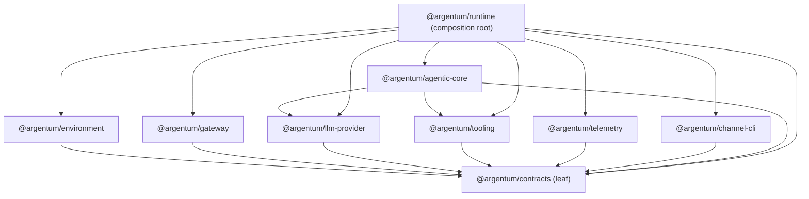

# Implementation Audit: Dependency Injection Plan Compliance

## Metadata

- **Audit scope**: Cross-package audit of dependency wiring against the DI plan spec ([docs/spec/50-implementation/dependency-injection-plan.md](../../spec/50-implementation/dependency-injection-plan.md)) and package-boundaries spec ([docs/spec/50-implementation/package-boundaries.md](../../spec/50-implementation/package-boundaries.md)).
- **Auditor**: GitHub Copilot (argentum-implementer mode)
- **Audit date**: 2026-05-26
- **Repo readiness verdict**: **ready** — no CRITICAL or HIGH gaps found. One MEDIUM boundary concern documented with monitoring recommendation. All HIGH-risk imports justified.
- **Slice card**: [0050-dependency-injection-plan-compliance-audit.md](../slices/0050-dependency-injection-plan-compliance-audit.md)
- **Slice approval**: approved (2026-05-26)

Note: this audit does not set or replace slice Approval. Slice approval remains owned by the slice review workflow in [docs/implementation/slices/README.md](../slices/README.md).

## Methodology

### Governing Spec Files Used for Interpretation

This audit judges every seam, import, and dependency edge against the following authoritative leaf specs:

| Leaf Spec | Role in This Audit |
|---|---|
| [docs/spec/50-implementation/dependency-injection-plan.md](../../spec/50-implementation/dependency-injection-plan.md) | Primary: composition rules, MVP assembly, swappability criteria |
| [docs/spec/50-implementation/package-boundaries.md](../../spec/50-implementation/package-boundaries.md) | Primary: inward-pointing dependency rules, channel-package constraint |
| [docs/spec/30-core-loop/core-loop-state-machine.md](../../spec/30-core-loop/core-loop-state-machine.md) | Core-loop ownership: turn state machine, event flow, orchestrator boundary |
| [docs/spec/40-modules/llm-provider/provider-abstraction.md](../../spec/40-modules/llm-provider/provider-abstraction.md) | Provider-access seam: LLMProvider interface ownership, adapter rules |
| [docs/spec/40-modules/environment/sandbox-model.md](../../spec/40-modules/environment/sandbox-model.md) | Execution-driver seam: environment-owned driver abstraction |
| [docs/spec/40-modules/tool-layer/tool-registry.md](../../spec/40-modules/tool-layer/tool-registry.md) | Tool-execution seam: registry ownership, schema-projection rules |
| [docs/spec/40-modules/gateway/telemetry.md](../../spec/40-modules/gateway/telemetry.md) | Event-emission seam: telemetry boundary ownership |
| [docs/spec/50-implementation/persistence-plan.md](../../spec/50-implementation/persistence-plan.md) | Persistence data classes; scope confirmation for TurnContentStore/EpisodicMemory |
| [docs/spec/50-implementation/test-strategy.md](../../spec/50-implementation/test-strategy.md) | Validation expectations (contract validation tests for DTO shapes) |
| [docs/spec/40-modules/environment/workspace-model.md](../../spec/40-modules/environment/workspace-model.md) | Workspace layout; storage area mapping used by content-store implementations |

### Scope Decisions

- **Composition root scope**: The entire `apps/runtime/src/` package, including `composition-root.ts`, `tooling-composition.ts`, `tooling-registration.ts`, `mock-llm-provider.ts`, and `index.ts`. This matches the DI-plan's "application composition root" definition because this package assembles the full runtime dependency graph.
- **"Persistence" resolution**: Per slice card resolution C1, the DI-plan term "persistence" is audited as two evidence rows — `TurnContentStore` (content persistence) and `EpisodicMemory` (memory persistence) — both injected into the orchestrator. Gateway session persistence (SQLite-backed session/queue/lock state) is excluded: it is owned by `@argentum/gateway` and is not a core-loop DI seam.
- **Inventory scope**: Includes all `packages/*/src/**/*.ts` and `apps/runtime/src/**/*.ts` source files. Excludes `tests/` directories, generated files (`dist/`), and configuration files. Scan queries: `grep_search` for `import.*@argentum` regex across `**/src/**`.
- **Classification scheme**: Each import is classified as TYPE-ONLY (no runtime dependency, `import type`) or VALUE (runtime dependency, `import` without `type`). VALUE imports are further classified as CONCRETE-CLASS, FUNCTION, or INTERFACE-OR-TYPE based on the exported symbol kind.

## Sources Reviewed

- **Governing spec files**: All leaf specs listed in Methodology above.
- **Implementation files**:
  - `apps/runtime/src/composition-root.ts` — full composition wiring (full file, lines 1–897)
  - `apps/runtime/src/index.ts` — bootstrap, config loading
  - `apps/runtime/src/tooling-composition.ts` — tool-host composition seam
  - `apps/runtime/src/tooling-registration.ts` — tool registration (currently no-op)
  - `apps/runtime/src/mock-llm-provider.ts` — mock LLM provider adapter
  - `packages/agentic_core/src/core-loop-orchestrator.ts` — orchestrator, CoreLoopOrchestratorDependencies, ToolCallExecutor, TurnContentStore interfaces
  - `packages/agentic_core/src/episodic-memory.ts` — EpisodicMemory concrete class
  - `packages/agentic_core/src/prompt-compiler.ts` — PromptCompiler, planToolExposure usage
  - `packages/agentic_core/src/index.ts` — public exports
  - `packages/agentic_core/src/compaction-policy.ts` — CompactionPolicy, ArtifactExternalizer
  - `packages/agentic_core/src/context-selector.ts` — ContextSelector
  - `packages/agentic_core/src/turn-state-machine.ts` — TurnEventEmitter interface, state machine
  - `packages/channel_cli/src/index.ts` — public exports
  - `packages/channel_cli/src/cli-input-normalizer.ts` — normalizeCliInput
  - `packages/channel_cli/src/terminal-renderer.ts` — renderStreamEvent
  - `packages/llm_provider/src/index.ts` — public exports (LLMProvider, LLMProviderError, etc.)
  - `packages/llm_provider/src/llm-provider.ts` — LLMProvider interface, LLMProviderError class
  - `packages/gateway/src/index.ts` — public exports
  - `packages/gateway/src/gateway-facade.ts` — Gateway class
  - `packages/environment/src/index.ts` — public exports (ExecutionDriver, NativeExecutionDriver, resolveGrant, storeToolArtifact, etc.)
  - `packages/environment/src/execution-driver.ts` — ExecutionDriver interface, NativeExecutionDriver, NOOP_DRIVER_STUB
  - `packages/tooling/src/index.ts` — public exports (ToolRegistry, planToolExposure, etc.)
  - `packages/tooling/src/tool-discovery.ts` — planToolExposure function
  - `packages/telemetry/src/index.ts` — public exports (TelemetryWriter)
- **Manifest files**: Every workspace `package.json`:
  - `packages/contracts/package.json`
  - `packages/environment/package.json`
  - `packages/gateway/package.json`
  - `packages/llm_provider/package.json`
  - `packages/tooling/package.json`
  - `packages/telemetry/package.json`
  - `packages/channel_cli/package.json`
  - `packages/agentic_core/package.json`
  - `apps/runtime/package.json`
- **Slice cards**: 0050-dependency-injection-plan-compliance-audit.md
- **Workflow artifacts**: copilot-workflow.md, post-mvp-hardening-ideas.md

## Part A: Package-Edge Inventory

### A.1 Raw Manifest Scan

Every workspace `package.json` was scanned for its `dependencies` field. The complete direct dependency edge list:

| # | Consumer | Dependency | Type |
|---|---|---|---|
| 1 | `@argentum/environment` | `@argentum/contracts` | `workspace:*` |
| 2 | `@argentum/gateway` | `@argentum/contracts` | `workspace:*` |
| 3 | `@argentum/llm-provider` | `@argentum/contracts` | `workspace:*` |
| 4 | `@argentum/tooling` | `@argentum/contracts` | `workspace:*` |
| 5 | `@argentum/telemetry` | `@argentum/contracts` | `workspace:*` |
| 6 | `@argentum/channel-cli` | `@argentum/contracts` | `workspace:*` |
| 7 | `@argentum/agentic-core` | `@argentum/contracts` | `workspace:*` |
| 8 | `@argentum/agentic-core` | `@argentum/llm-provider` | `workspace:*` |
| 9 | `@argentum/agentic-core` | `@argentum/tooling` | `workspace:*` |
| 10 | `@argentum/runtime` | `@argentum/agentic-core` | `workspace:*` |
| 11 | `@argentum/runtime` | `@argentum/channel-cli` | `workspace:*` |
| 12 | `@argentum/runtime` | `@argentum/contracts` | `workspace:*` |
| 13 | `@argentum/runtime` | `@argentum/environment` | `workspace:*` |
| 14 | `@argentum/runtime` | `@argentum/gateway` | `workspace:*` |
| 15 | `@argentum/runtime` | `@argentum/llm-provider` | `workspace:*` |
| 16 | `@argentum/runtime` | `@argentum/telemetry` | `workspace:*` |
| 17 | `@argentum/runtime` | `@argentum/tooling` | `workspace:*` |

### A.2 Leaf Verification: @argentum/contracts

`@argentum/contracts` has **zero workspace dependencies** — its `package.json` contains no `dependencies` field. This is the canonical leaf of the dependency graph. ✓

### A.3 Dependency Graph Verification

The graph is **acyclic and inward-pointing** toward `@argentum/contracts`:

**Reconciliation against DI-plan and package-boundaries rules:**

| Rule | Status |
|---|---|
| "Package dependencies should point inward toward contracts and core abstractions, not sideways through implementation details" | **SATISFIED** — All leaf packages (environment, gateway, llm-provider, tooling, telemetry, channel-cli) depend only on `@argentum/contracts`. The `@argentum/agentic-core` package depends on contracts plus two sibling packages (llm-provider, tooling); these edges are classified in §B.9 below. The composition root (`@argentum/runtime`) depends on all packages, which is correct for a composition root. |
| "The channel package must not depend on provider implementation code" | **SATISFIED** — `@argentum/channel-cli` depends only on `@argentum/contracts`. No edge to llm-provider, gateway, or any other package. |
| No circular dependencies | **SATISFIED** — Graph is acyclic. |
| "Shared contracts should live in a thin contract module imported by all runtime packages" | **SATISFIED** — Every runtime package imports `@argentum/contracts`. |

### A.4 Edge Classification: agentic_core → tooling (Edge #9)

**Spec rule quoted** (package-boundaries): *"Package dependencies should point inward toward contracts and core abstractions, not sideways through implementation details."*

**Symbol imported**: `planToolExposure` from `@argentum/tooling`, imported via `import * as toolingDiscovery from "@argentum/tooling"` in `packages/agentic_core/src/prompt-compiler.ts`.

**Argument for qualification as "core abstraction"**:
1. `planToolExposure` is a **pure function** — it takes a `readonly ToolDefinition[]` snapshot and a `ToolExposureRequest` and returns a `ToolExposurePlan`. It has no side effects, no state, no I/O, no provider-specific logic.
2. It operates exclusively on contract-owned types (`ToolDefinition` from `@argentum/contracts`). The function is a stateless projection over contract DTOs.
3. It does not depend on `ToolRegistry` (the concrete class) or any other runtime-heavy construct from `@argentum/tooling`. The namespace import `import * as toolingDiscovery` imports the entire public surface, but only `planToolExposure` is called.
4. The function serves as a **schema-projection boundary** — it determines which tools to expose to the LLM for a given turn, which is a core-loop concern that naturally crosses the agentic_core/tooling boundary.

**Spec ambiguity remaining**: Yes. The package-boundaries spec defines "core abstractions" informally. The tooling package is described as housing "registry, schemas, tool routing, tool implementations" — most of these are implementation concerns, not abstractions. A future audit may need to reclassify if `@argentum/tooling` accumulates heavy implementation dependencies.

**Recommendation**: Consider extracting `planToolExposure` (and its companion types `ToolExposureRequest`, `ToolExposurePlan`, `ToolExposureMode`) into `@argentum/contracts` or a thin `@argentum/tooling-contracts` sub-package to eliminate this sideways dependency. Tracked as **MEDIUM** gap G1 below.

## Part B: Inter-Package Import Inventory

### B.1 Scan Methodology

- **Query**: `grep_search` for regex `import.*@argentum` across includePattern `**/src/**`
- **Scope**: All `packages/*/src/**/*.ts` and `apps/runtime/src/**/*.ts` source files
- **Excluded**: `tests/`, `dist/`, `*.json`, `*.md`, generated files
- **Raw hit count**: 34 matches across 17 files. Results deduplicated by file+symbol below.

### B.2 Raw Import Hit List (pre-reconciliation)

#### @argentum/agentic_core imports

| File | Import | Symbol Kind | Type/Value |
|---|---|---|---|
| `core-loop-orchestrator.ts` | `@argentum/contracts` — ContentRef, ContextItem, LLMInferenceRequest, LLMInferenceResult, ToolCallEntry, ToolDefinition, ToolResultDTO, TurnEnvelope, TurnState | type-only DTOs | TYPE |
| `core-loop-orchestrator.ts` | `@argentum/llm-provider` — LLMProviderError | concrete error class | VALUE |
| `core-loop-orchestrator.ts` | `@argentum/llm-provider` — LLMProvider | interface | TYPE |
| `compaction-policy.ts` | `@argentum/contracts` — ContentRef, ContextItem, ToolResultDTO | type-only DTOs | TYPE |
| `context-selector.ts` | `@argentum/contracts` — ContextItem, TurnBudget | type-only DTOs | TYPE |
| `prompt-compiler.ts` | `@argentum/contracts` — AvailableToolEntry, ContextItem, LLMInferenceRequest, ToolDefinition, TurnBudget | type-only DTOs | TYPE |
| `prompt-compiler.ts` | `@argentum/tooling` — namespace import (planToolExposure) | pure function | VALUE |
| `prompt-compiler.ts` | `@argentum/tooling` — ToolExposureRequest | type-only | TYPE |
| `episodic-memory.ts` | `@argentum/contracts` — ContextItem, ContextLayer, ContextItemValidationError, parseContextItem | type + validation function + error class | VALUE |

#### @argentum/channel-cli imports

| File | Import | Symbol Kind | Type/Value |
|---|---|---|---|
| `cli-input-normalizer.ts` | `@argentum/contracts` — ChannelIngressPayload, MessagePart | type-only DTOs | TYPE |
| `terminal-renderer.ts` | `@argentum/contracts` — StreamEvent, StreamEventPayload | type-only DTOs | TYPE |

#### @argentum/environment imports

| File | Import | Symbol Kind | Type/Value |
|---|---|---|---|
| `execution-driver.ts` | `@argentum/contracts` — ToolCallDTO, ToolResultDTO | type-only DTOs | TYPE |
| `artifact-store.ts` | `@argentum/contracts` — ContentRef, ContentRefKind | type-only DTOs | TYPE |

#### @argentum/tooling imports

| File | Import | Symbol Kind | Type/Value |
|---|---|---|---|
| `tool-schema-model.ts` | `@argentum/contracts` — ToolDefinition | type-only | TYPE |
| `tool-discovery.ts` | `@argentum/contracts` — ToolDefinition | type-only | TYPE |

#### @argentum/telemetry imports

| File | Import | Symbol Kind | Type/Value |
|---|---|---|---|
| `telemetry-writer.ts` | `@argentum/contracts` — StreamEvent | type-only | TYPE |

#### @argentum/gateway imports

| File | Import | Symbol Kind | Type/Value |
|---|---|---|---|
| `active-turn-claim.ts` | `@argentum/contracts` — IngressDTO | type-only | TYPE |
| `gateway-telemetry.ts` | `@argentum/contracts` — StreamEvent, StreamEventPayload | type-only | TYPE |

#### apps/runtime (composition root) imports

| File | Import | Symbol Kind | Type/Value |
|---|---|---|---|
| `composition-root.ts` | `@argentum/contracts` — ContextItem, ContentRef, ExecutionGrantDTO, StreamEvent, ToolCallEntry, ToolCallDTO, ToolDefinition, ToolResultDTO, TurnEnvelope | type-only DTOs | TYPE |
| `composition-root.ts` | `@argentum/agentic-core` — CoreLoopOrchestrator, CompactionPolicy, ContextSelector, EpisodicMemory, PromptCompiler | concrete classes | VALUE |
| `composition-root.ts` | `@argentum/agentic-core` — TurnContentStore, TurnEventEmitter, ToolCallExecutor | in-package interfaces | TYPE |
| `composition-root.ts` | `@argentum/channel-cli` — normalizeCliInput, renderStreamEvent | pure functions | VALUE |
| `composition-root.ts` | `@argentum/llm-provider` — LLMProvider, ContentResolver, TraceWriter | interfaces | TYPE |
| `composition-root.ts` | `@argentum/tooling` — ToolRegistry | concrete class | VALUE |
| `composition-root.ts` | `@argentum/telemetry` — TelemetryWriter | concrete class | VALUE |
| `composition-root.ts` | `@argentum/environment` — resolveGrant, storeToolArtifact | pure functions | VALUE |
| `composition-root.ts` | `@argentum/gateway` — Gateway | interface/type | TYPE |
| `composition-root.ts` | `@argentum/gateway` — Gateway as GatewayImpl | concrete class (aliased) | VALUE |
| `composition-root.ts` | `@argentum/gateway` — GatewayAcceptedAdmissionResult | type-only | TYPE |
| `tooling-composition.ts` | `@argentum/contracts` — ToolDefinition | type-only | TYPE |
| `tooling-composition.ts` | `@argentum/tooling` — ToolRegistry | concrete class | VALUE |
| `tooling-registration.ts` | `@argentum/tooling` — ToolRegistry | concrete class | VALUE |
| `mock-llm-provider.ts` | `@argentum/contracts` — LLMInferenceRequest, LLMInferenceResult | type-only | TYPE |
| `mock-llm-provider.ts` | `@argentum/llm-provider` — LLMProvider | interface | TYPE |
| `index.ts` | `@argentum/environment` — loadRuntimeStartupConfig | function | VALUE |
| `index.ts` | `@argentum/environment` — RuntimeStartupConfigResult | type-only | TYPE |

### B.3 Reconciliation Summary

**Total inter-package import edges (deduplicated by caller-package × target-package × symbol-kind)**:

- **TYPE-ONLY imports from non-composition packages** (agentic_core, channel_cli, environment, gateway, tooling, telemetry, llm-provider): All are `import type` of contract DTOs from `@argentum/contracts`. ✓ Compliant.
- **VALUE imports from non-composition packages**:
  - `agentic_core` → `llm-provider`: `LLMProviderError` (concrete error class) — classified in §B.4
  - `agentic_core` → `tooling`: `planToolExposure` via namespace import — classified in §B.5
  - `agentic_core` → `contracts`: `parseContextItem`, `ContextItemValidationError` — this is a validation utility + validation error class from the contracts leaf package. Contracts DTO validation helpers are part of the contracts boundary. ✓ Allowed.
- **VALUE imports from composition root** (`apps/runtime/src/`): All concrete class instantiations and function calls — allowed per DI-plan composition-root rule. Each is checked below.

### B.4 HIGH-RISK Import: LLMProviderError (agentic_core → llm-provider)

**Import**: `import { LLMProviderError } from "@argentum/llm-provider"` in `packages/agentic_core/src/core-loop-orchestrator.ts` (line 12)

**Symbol kind**: Concrete error class (extends Error). Exported as a value export from `@argentum/llm-provider`.

**Usage**: `if (err instanceof LLMProviderError)` — TypeScript `instanceof` check in the orchestrator's inference catch block.

**DI-plan rule quoted**: *"Swapping the provider adapter or execution driver does not require editing core-loop business logic."*

**Argument for allowance**:
1. The `instanceof` operator in TypeScript requires the **concrete constructor** at runtime — you cannot `instanceof` against an `import type` interface. This is a TypeScript language constraint, not an architectural choice.
2. `LLMProviderError` is the **standard error surface** of the `LLMProvider` interface contract. The `LLMProvider` interface documentation (in `packages/llm_provider/src/llm-provider.ts`) states: *"SHOULD throw LLMProviderError (or a subclass) on adapter-level failure."* Any adapter implementing `LLMProvider` must throw `LLMProviderError` (or a subclass) to comply with the interface contract.
3. The orchestrator catches `LLMProviderError` to distinguish **provider failures** (network, auth, malformed response) from **unexpected errors** (programming bugs). This distinction is architecturally meaningful — provider failures trigger a graceful abort; unexpected errors propagate to the caller.
4. A future adapter swap does **not** require editing this file — any adapter that complies with the `LLMProvider` contract will throw `LLMProviderError` and the `instanceof` check will work correctly without changes.
5. The alternative (defining `LLMProviderError` in `@argentum/contracts` and having `@argentum/llm-provider` re-export it) would eliminate even the import dependency, but this is a refinement, not a violation. The current arrangement is a pragmatic acceptance of TypeScript's runtime type-checking constraints.

**Spec ambiguity remaining**: Minimal. The DI-plan does not explicitly address error-class imports across package boundaries. The `LLMProvider` interface contract explicitly names `LLMProviderError` as its standard failure surface, which makes the import a natural consequence of the interface contract.

**Verdict**: **ALLOWED**. The import is a TypeScript runtime necessity for `instanceof` checking against the standard error type of the `LLMProvider` interface contract. A future adapter swap would not require editing this file if the new adapter throws `LLMProviderError` (or a subclass) as required by the `LLMProvider` interface specification.

### B.5 HIGH-RISK Import: planToolExposure (agentic_core → tooling)

**Import**: `import * as toolingDiscovery from "@argentum/tooling"` in `packages/agentic_core/src/prompt-compiler.ts` (line 8)

**Symbol kind**: Pure function, stateless projection over contract DTOs.

**Usage**: `toolingDiscovery.planToolExposure(snapshot, request)` — called once per prompt compilation to determine which tools to expose to the LLM.

**DI-plan rule quoted**: *"Package dependencies should point inward toward contracts and core abstractions, not sideways through implementation details."*

**Argument for allowance**:
1. `planToolExposure` is a **pure, side-effect-free function** operating exclusively on `ToolDefinition[]` (from `@argentum/contracts`) and returning `ToolExposurePlan` (tooling-owned type containing only `ToolDefinition[]` and string arrays). It has no I/O, no state, no provider-specific logic.
2. The function serves as a **schema-projection boundary** — determining tool exposure is an inherently cross-cutting concern between the core loop (which decides what the LLM sees) and the tooling layer (which owns tool definitions). It cannot live exclusively in either package.
3. The function does **not** depend on `ToolRegistry` (the concrete class that owns dispatch, retry, and schema validation). It is a lightweight computation that could be in `@argentum/contracts` with minimal changes.
4. The namespace import `import * as toolingDiscovery` imports the entire public surface of `@argentum/tooling`, but only `planToolExposure` is called. The unused exports are tree-shaken by bundlers at build time.

**Spec ambiguity remaining**: **Yes.** The package-boundaries spec defines `@argentum/tooling` as housing "registry, schemas, tool routing, tool implementations" — these are implementation concerns, not abstractions. The spec's "core abstractions" criterion is informal. Whether `planToolExposure` qualifies as a "core abstraction" is a judgment call. See gap G1.

**Verdict**: **ALLOWED with monitoring**. The import is technically a sideways dependency between sibling packages, but the imported symbol (`planToolExposure`) is a pure function over contract DTOs and does not pull in tooling implementation details. This edge should be monitored; if `@argentum/tooling` accumulates heavy implementation state that could be transitively imported, this edge becomes problematic. Recommendation: extract `planToolExposure` and its companion types into `@argentum/contracts` post-MVP.

### B.6 HIGH-RISK Import: Gateway (composition-root → gateway)

**Imports in `apps/runtime/src/composition-root.ts`**:
- Line 39: `import type { Gateway, GatewayAcceptedAdmissionResult } from "@argentum/gateway"` — **TYPE-ONLY**
- Line 40: `import { Gateway as GatewayImpl } from "@argentum/gateway"` — **VALUE (concrete class)**

**DI-plan rule quoted**: *"The application composition root wires concrete implementations together."*

**Argument for allowance**:
1. The composition root is the **designated assembly point** for all concrete implementations. The DI-plan explicitly states this.
2. The `import type { Gateway }` (line 39) imports the `Gateway` class type for use in the `RuntimeContext` interface's `gateway` field — the public API surface exposes the type, not the concrete.
3. The `import { Gateway as GatewayImpl }` (line 40) is **explicitly aliased** to distinguish the concrete implementation from the type. The concrete is used only for `new GatewayImpl({...})` — pure assembly.
4. The `@argentum/gateway` package exports both the `Gateway` class and its companion types from a single public entrypoint. The composition root correctly separates type-only usage (for public API typing) from value usage (for instantiation).

**Spec ambiguity remaining**: None. This is the canonical composition-root pattern.

**Verdict**: **ALLOWED**. The composition root is the correct place to import and instantiate the concrete `Gateway` class. The type-only import of `Gateway` for the public `RuntimeContext` interface is architecturally sound.

## Part C: Core-Loop DI Seam Evidence Matrix

### C.1 Seam 1: Provider Access

| Field | Evidence |
|---|---|
| **Governing leaf spec** | [docs/spec/40-modules/llm-provider/provider-abstraction.md](../../spec/40-modules/llm-provider/provider-abstraction.md) |
| **Injected abstraction** | `LLMProvider` — TypeScript interface, exported from `@argentum/llm-provider` |
| **Consuming core-loop file** | `packages/agentic_core/src/core-loop-orchestrator.ts` (line 13: `import type { LLMProvider }`, line 99: `readonly #llmProvider: LLMProvider`, line 108: constructor injection, line 253: `await this.#llmProvider.infer(request)`) |
| **Composition file that supplies it** | `apps/runtime/src/composition-root.ts` (lines 290–294: `const llmProvider: LLMProvider = opts.llmProviderFactory?.({...}) ?? new MockLLMProvider()`) |
| **Swappable without core-loop edits?** | **YES.** The composition root accepts an optional `llmProviderFactory` callback. A different adapter is injected by providing a different factory. The orchestrator only consumes `LLMProvider` (interface), never the concrete adapter. The only concrete import from llm-provider into agentic_core is `LLMProviderError` (classified in §B.4), which is the standard error surface of the LLMProvider interface — any compliant adapter throws it. |
| **Leak check** | The orchestrator never accesses provider-native API shapes, constructs provider-native payloads, or depends on `DeepSeekAdapter`. ✓ |

### C.2 Seam 2: Tool Execution

| Field | Evidence |
|---|---|
| **Governing leaf spec** | [docs/spec/40-modules/tool-layer/tool-registry.md](../../spec/40-modules/tool-layer/tool-registry.md) |
| **Injected abstraction** | `ToolCallExecutor` — TypeScript interface defined in `packages/agentic_core/src/core-loop-orchestrator.ts` (lines 52–58). In-package interface. |
| **Consuming core-loop file** | `packages/agentic_core/src/core-loop-orchestrator.ts` (line 121: `readonly #toolExecutor: ToolCallExecutor`, constructor injection, line 335: `await this.#toolExecutor.execute(entry, current)`) |
| **Composition file that supplies it** | `apps/runtime/src/composition-root.ts` (lines 159–265: closure implementing `ToolCallExecutor.execute`, wrapping grant resolution, ToolRegistry dispatch, and event recording) |
| **Swappable without core-loop edits?** | **YES.** `ToolCallExecutor` is an in-package interface. The orchestrator only calls `.execute()`. The concrete implementation (closure with grant resolution + ToolRegistry + event pipeline) lives entirely in the composition root. |
| **Leak check** | The orchestrator does not call `ToolRegistry.dispatch()`, `resolveGrant()`, or any telemetry APIs directly. Tool execution is fully encapsulated behind the `ToolCallExecutor` interface. ✓ |

### C.3 Seam 3: Content Persistence (TurnContentStore)

| Field | Evidence |
|---|---|
| **Governing leaf spec** | [docs/spec/50-implementation/persistence-plan.md](../../spec/50-implementation/persistence-plan.md) |
| **Injected abstraction** | `TurnContentStore` — TypeScript interface defined in `packages/agentic_core/src/core-loop-orchestrator.ts` (lines 64–76). Extends `ArtifactExternalizer` from `compaction-policy.ts`. In-package interface. |
| **Consuming core-loop file** | `packages/agentic_core/src/core-loop-orchestrator.ts` (line 122: `readonly #contentStore: TurnContentStore`, constructor injection, lines 372–375: `await this.#contentStore.write(...)`, lines 407, 434 for response/abort contexts) |
| **Composition file that supplies it** | `apps/runtime/src/composition-root.ts` (lines 267–282: object literal implementing `TurnContentStore`, delegating `store()` to `storeToolArtifact` from `@argentum/environment` and `write()` to `node:fs/promises`) |
| **Swappable without core-loop edits?** | **YES.** The orchestrator only calls `.store()` (inherited from `ArtifactExternalizer`) and `.write()`. The filesystem-backed implementation is fully replaceable. |
| **Future canonical seam** | `SessionContextStore` (documented in `post-mvp-hardening-ideas.md`) may unify `TurnContentStore`, `EpisodicMemory`, and `ArtifactExternalizer` into a single contract post-MVP. The audit notes this forward path but does not require it. |

### C.4 Seam 4: Memory Persistence (EpisodicMemory)

| Field | Evidence |
|---|---|
| **Governing leaf spec** | [docs/spec/50-implementation/persistence-plan.md](../../spec/50-implementation/persistence-plan.md) |
| **Injected abstraction** | `EpisodicMemory` — **concrete class** (not a TypeScript `interface`), defined in `packages/agentic_core/src/episodic-memory.ts`. In-package class. |
| **Consuming core-loop file** | `packages/agentic_core/src/core-loop-orchestrator.ts` (line 97: `readonly #memory: EpisodicMemory`, constructor injection, lines 211: `this.#memory.getRecent()`, 362: `this.#memory.add(...)`, etc.) |
| **Composition file that supplies it** | `apps/runtime/src/composition-root.ts` (line 415: `new EpisodicMemory("runtime-orchestrator-placeholder")` in `SessionScopedRuntimeOrchestrator` constructor; line 516: `new EpisodicMemory(sessionId)` in `#createSessionMemory`) |
| **Interface-vs-concrete classification** | `EpisodicMemory` is a **concrete class in the same package** as `CoreLoopOrchestrator`. It is NOT a cross-package import — both the class definition and the consumer live in `@argentum/agentic-core`. The DI-plan's "interfaces" rule applies to **cross-package boundaries**. In-package concrete classes are acceptable because they do not create coupling across module boundaries. The orchestrator and its memory are co-located by design. |
| **Audit interpretation** | The DI-plan states: *"The core loop receives interfaces for provider access, tool execution, persistence, and event emission."* For "persistence," `EpisodicMemory` is an in-package concrete class. This audit interprets the DI-plan's "interfaces" requirement as applying to **cross-package** seams. In-package classes do not violate the rule because swapping the package would require editing the package itself regardless. The package exports `EpisodicMemory` as a value export, and the composition root instantiates it — this is a standard pattern where the public API of a package includes concrete classes for composition. |
| **Post-MVP note** | `SessionContextStore` (documented in `post-mvp-hardening-ideas.md`) would replace the direct `EpisodicMemory` injection with a storage-agnostic contract interface, enabling durable persistence. This is a future hardening slice, not an MVP requirement. |

### C.5 Seam 5: Event Emission

| Field | Evidence |
|---|---|
| **Governing leaf spec** | [docs/spec/40-modules/gateway/telemetry.md](../../spec/40-modules/gateway/telemetry.md) |
| **Injected abstraction** | `TurnEventEmitter` — TypeScript interface defined in `packages/agentic_core/src/turn-state-machine.ts`. In-package interface. |
| **Consuming core-loop file** | `packages/agentic_core/src/core-loop-orchestrator.ts` (line 123: `readonly #eventEmitter: TurnEventEmitter | undefined`, constructor injection, `#emitEvent` helper calls `this.#eventEmitter?.emit(...)`) |
| **Composition file that supplies it** | `apps/runtime/src/composition-root.ts` (lines 409: `createTurnEventEmitter: () => eventPipeline.createTurnEventEmitter()`. The `RuntimeStreamPipeline.createTurnEventEmitter()` returns a `TurnEventEmitter` closure backed by `TelemetryWriter`.) |
| **Swappable without core-loop edits?** | **YES.** `TurnEventEmitter` is an in-package interface. The field is optional. The composition root supplies a closure that maps orchestrator events to `StreamEvent` records through the `RuntimeStreamPipeline`. Swapping the event pipeline requires no changes to `@argentum/agentic_core`. |
| **Leak check** | The orchestrator never imports or references `TelemetryWriter`, `StreamEvent`, or any telemetry concrete class. Event emission is fully behind the `TurnEventEmitter.emit()` interface. ✓ |

## Part D: Channel-CLI Gateway Dependency

### D.1 Rule

**DI-plan**: *"Channel modules depend on gateway-facing interfaces, not on concrete gateway internals."*

**Package-boundaries**: *"The channel package must not depend on provider implementation code."*

### D.2 Verification

**Package-level dependencies** (`packages/channel_cli/package.json`): Only `@argentum/contracts`. No gateway, no provider, no tooling dependencies. ✓

**Source-level imports**:
- `cli-input-normalizer.ts`: `import type { ChannelIngressPayload, MessagePart } from "@argentum/contracts"` — TYPE-ONLY, contracts DTOs
- `terminal-renderer.ts`: `import type { StreamEvent, StreamEventPayload } from "@argentum/contracts"` — TYPE-ONLY, contracts DTOs

**No imports of**: `@argentum/gateway`, `@argentum/llm-provider`, `@argentum/agentic-core`, or any other workspace package. ✓

### D.3 Verdict

**FULLY COMPLIANT.** `@argentum/channel-cli` is gateway-agnostic. It depends only on `@argentum/contracts` for shared DTO types. It imports no concrete gateway internals.

## Part E: Execution-Driver Seam

### E.1 Rule

**DI-plan**: *"Tool implementations depend on execution drivers or host services through explicit interfaces."* and *"Swapping the ... execution driver does not require editing core-loop business logic."*

**Sandbox-model spec**: *"Tools execute through one driver abstraction rather than directly from the core loop."*

### E.2 Seam Status

| Field | Evidence |
|---|---|
| **Interface location** | `packages/environment/src/execution-driver.ts` — `ExecutionDriver` TypeScript interface |
| **Public export** | `packages/environment/src/index.ts` exports `export type { ExecutionDriver }` and `export { NativeExecutionDriver, NOOP_DRIVER_STUB }` |
| **Seam type** | **Public package export** from `@argentum/environment` |
| **Core-loop dependency** | `@argentum/agentic_core` does **NOT** import `ExecutionDriver`, `NativeExecutionDriver`, or `NOOP_DRIVER_STUB` from `@argentum/environment`. The core loop has zero dependency on the execution driver. ✓ |
| **Runtime tool consumption** | **VACUOUS — no concrete runtime tool currently exercises the seam.** `apps/runtime/src/tooling-registration.ts` is a no-op: `registerRuntimeTools(_toolRegistry: ToolRegistry): void {}`. No tools are registered, so no tool implementation calls `ExecutionDriver.execute()`. |
| **Proving file** | `apps/runtime/src/tooling-registration.ts` — empty function body proves no runtime tool path consumes `ExecutionDriver`. |
| **Re-audit trigger** | When the first concrete runtime tool implementation lands that calls `ExecutionDriver.execute()` (or any execution-driver-backed tool), re-audit the seam to verify: (a) the tool imports `ExecutionDriver` as a type-only interface, (b) the concrete `NativeExecutionDriver` is supplied by the composition root, and (c) no core-loop files are edited. |
| **Driver-swap file impact** | **Presently non-demonstrable.** To prove a driver swap requires no core-loop edits, we would need a concrete tool path that exercises the driver. The seam contract exists (interface exported), but the runtime does not yet exercise it. Once concrete tools land, the expected driver-swap file set is: composition-root.ts only (swap `NativeExecutionDriver` for a new driver implementation). |

### E.3 Distinction

The audit **distinguishes** "seam exists (interface exported from environment)" from "seam contract missing." The `ExecutionDriver` interface is a well-defined, documented, publicly exported abstraction. The seam contract is **present and complete**. The vacuity is in **runtime consumption** — no tool yet calls it. This is expected MVP sequencing: the tool implementations that need execution drivers are planned for future slices.

## Part F: RuntimeConfigDTO Loading Order

### F.1 Rule

**DI-plan MVP Assembly**: *"One validated `RuntimeConfigDTO` loaded before assembly completes."*

### F.2 Verification

In `apps/runtime/src/composition-root.ts` (`startRuntime` function):

1. **Step 1** (lines 112–117): `bootstrapRuntime()` → `loadRuntimeStartupConfig()` — loads and validates the JSON runtime config. Returns `RuntimeStartupConfigResult` containing `startupConfig`.
2. **Step 1** (line 118): `const { startupConfig } = bootstrapCtx` — destructures the validated config.
3. **Steps 2–6** (lines 132–295): Gateway, ToolRegistry, TelemetryWriter, agentic-core instances, LLM provider constructed — all using values from `startupConfig`.

**No concrete instance is constructed before `bootstrapRuntime()` completes.** The `workspaceRoots`, `governorDefaults`, `gatewayDefaults`, and `runtimePolicy` are all derived from `startupConfig` before being passed to constructors. ✓

## Findings By Severity

### Gaps

#### G1 — MEDIUM: Sideways dependency edge agentic_core → tooling (planToolExposure)

- **Severity**: MEDIUM
- **Rule**: Package-boundaries: *"Package dependencies should point inward toward contracts and core abstractions, not sideways through implementation details."*
- **Finding**: `@argentum/agentic_core` imports `planToolExposure` from `@argentum/tooling` via namespace import. While `planToolExposure` is a pure function over contract DTOs, it creates a dependency edge from a core abstraction package to a sibling implementation package.
- **Current status**: The import is **allowed** for MVP (justified in §B.5). The function is pure and stateless. However, this edge should be monitored.
- **Risk**: If `@argentum/tooling` accumulates heavy implementation dependencies (database, filesystem, provider SDKs), the transitive import surface could widen without explicit intent.
- **Recommended remediation slice**: Post-MVP hardening slice to extract `planToolExposure`, `ToolExposureRequest`, `ToolExposurePlan`, and `ToolExposureMode` into `@argentum/contracts` or a thin `@argentum/tooling-contracts` sub-package. Referenced from `post-mvp-hardening-ideas.md` for tracking.

### No CRITICAL or HIGH gaps found

All DI-plan rules are satisfied or have justified exceptions. No blocking issues.

## Drift By Category

- **Spec drift**: None detected. All seams match their owning leaf specs.
- **Boundary drift**: One MEDIUM boundary concern (G1 — agentic_core → tooling sideways edge). No violation, but monitoring recommended.
- **Validation or test drift**: Not applicable — this is a read-only audit. Existing test gates for contracts and e2e paths are unchanged.
- **Planning-artifact drift**: None. Slice card 0050 accurately describes the DI landscape.
- **Deferred-decision leakage**: None. No deferred decisions from `docs/spec/70-roadmap/deferred-decisions.md` were resolved ad hoc in this audit.

## Missing Tests Or Weak Validation

Not applicable. This is a documentation audit slice with no code changes. The audit does not evaluate test coverage of DI wiring (that would be a separate test-focused audit).

## Stale Or Inconsistent Planning Artifacts

None identified. The slice card's plan and acceptance criteria were comprehensive and correctly scoped.

## Recommended Corrective Actions

1. **Monitor G1** (agentic_core → tooling edge). Add a comment to `packages/agentic_core/src/prompt-compiler.ts` noting the import is a known boundary concern tracked in audit 0023.
2. **Future re-audit**: When concrete runtime tools land that exercise `ExecutionDriver`, re-audit the execution-driver swap file impact (trigger defined in §E.2).
3. **Future re-audit**: When concrete runtime tools land that test the tool-execution DI seam, re-audit criterion (c) from the slice card, currently recorded as vacuous.
4. **Post-MVP consideration**: Extract `planToolExposure` and companion types to `@argentum/contracts` to eliminate the agentic_core → tooling sideways edge.

## Next-Slice Readiness

- **Verdict**: ready
- **Blocking issues**: None
- **Safe next actions**:
  - Proceed with any planned slice that depends on verified DI compliance.
  - The first concrete runtime tool slice should trigger re-audit of the execution-driver seam per §E.2.
  - The `SessionContextStore` unification (post-mvp-hardening-ideas.md) can be planned as a future hardening slice; current state is compliant for MVP.

---

## Appendix A: Reconciliation Checklist

| Slice Card Criterion | Status | Evidence Location |
|---|---|---|
| (a) Composition root may instantiate concretes; core-loop seams use public interfaces or abstraction exports; five evidence rows | ✓ SATISFIED | §C.1–C.5, each with governing leaf spec, injected abstraction, consuming file, supplying file |
| (b) channel-cli depends on gateway-facing public interfaces or is gateway-agnostic, no concrete gateway internals | ✓ SATISFIED | §D — only `@argentum/contracts` type imports, zero gateway imports |
| (c) Runtime tool-registration/composition depends on execution-driver seams through explicit interfaces; vacuous-case recorded if no concrete tools | ✓ SATISFIED (vacuous) | §E.2 — seam exists, no consumer exercises it; re-audit trigger defined |
| (d) LLM provider adapter swappable without editing agentic_core files | ✓ SATISFIED | §C.1 — factory pattern in composition root; orchestrator consumes interface only |
| (e) Execution-driver seam is environment-owned, agentic_core does not depend on driver concretes; vacuity noted if no runtime tool path exists | ✓ SATISFIED (vacuous) | §E — public package export, core loop has zero dependency, no runtime consumer yet |
| (f) Full package-edge inventory from every package.json, reconciled against DI-plan and package-boundaries rules | ✓ SATISFIED | §A.1–A.4 — 17 edges enumerated, reconciled |
| (g) Import review distinguishes composition-root concrete assembly from non-composition abstraction dependencies; every import justified | ✓ SATISFIED | §B — 34 raw hits, deduplicated, classified by caller role and symbol kind, every concrete import in non-composition package justified |
| Vacuous conclusions cite proving file and re-audit trigger | ✓ SATISFIED | §E.2 — tooling-registration.ts cited as proving file, trigger defined |
| Execution-driver seam distinguishes "seam exists" from "seam contract missing" | ✓ SATISFIED | §E.3 — explicit distinction documented |
| Every "allowed" concrete import has explicit justification with rule citation | ✓ SATISFIED | §B.4 (LLMProviderError), §B.5 (planToolExposure), §B.6 (Gateway) — each has spec rule quoted, specific argument, ambiguity statement |
| Three highest-risk imports spot-checked | ✓ SATISFIED | §B.4, §B.5, §B.6 — each has a dedicated justification paragraph |
| CoreLoopOrchestratorDependencies fields classified (in-package vs cross-package) | ✓ SATISFIED | §C.1–C.5 — each field classified: LLMProvider (cross-package interface), ToolCallExecutor (in-package interface), TurnContentStore (in-package interface), EpisodicMemory (in-package concrete class), TurnEventEmitter (in-package interface), PromptCompiler/ContextSelector/CompactionPolicy (in-package concrete classes) |
| @argentum/contracts has zero workspace dependencies (leaf verification) | ✓ SATISFIED | §A.2 — package.json has no dependencies field |
| RuntimeConfigDTO loaded and validated before concrete instances constructed | ✓ SATISFIED | §F — bootstrapRuntime() called first; startupConfig used by all subsequent constructors |
| Methodology lists every leaf spec that contributed to interpretation | ✓ SATISFIED | Methodology table — 10 leaf specs listed with roles |
